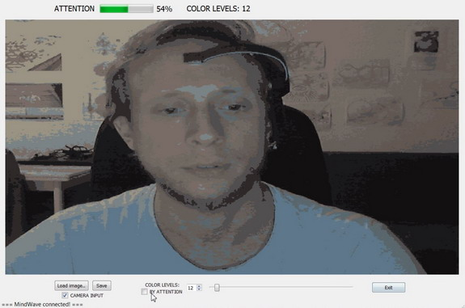
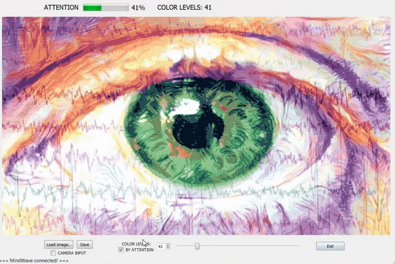

# color-levels-transform

Color levels image transformation with PyQt / Pillow / OpenCV and mobile EEG (MindWave NeuroSky).

The transformation is based on Pillow function convert with ADAPTIVE palette.

https://pillow.readthedocs.io/en/3.1.x/reference/Image.html

Transformation is possible both on camera input flow or on chosen image, 

with number of color levels defined by user or depended on Attention level (estimated by EEG device)

The application is mainly an example of using PyQt library with OpenCV and mobile EEG data.

==== third-party code / libraries licenses: ====

NeuroPy by Sahil Singh

https://github.com/lihas/NeuroPy
